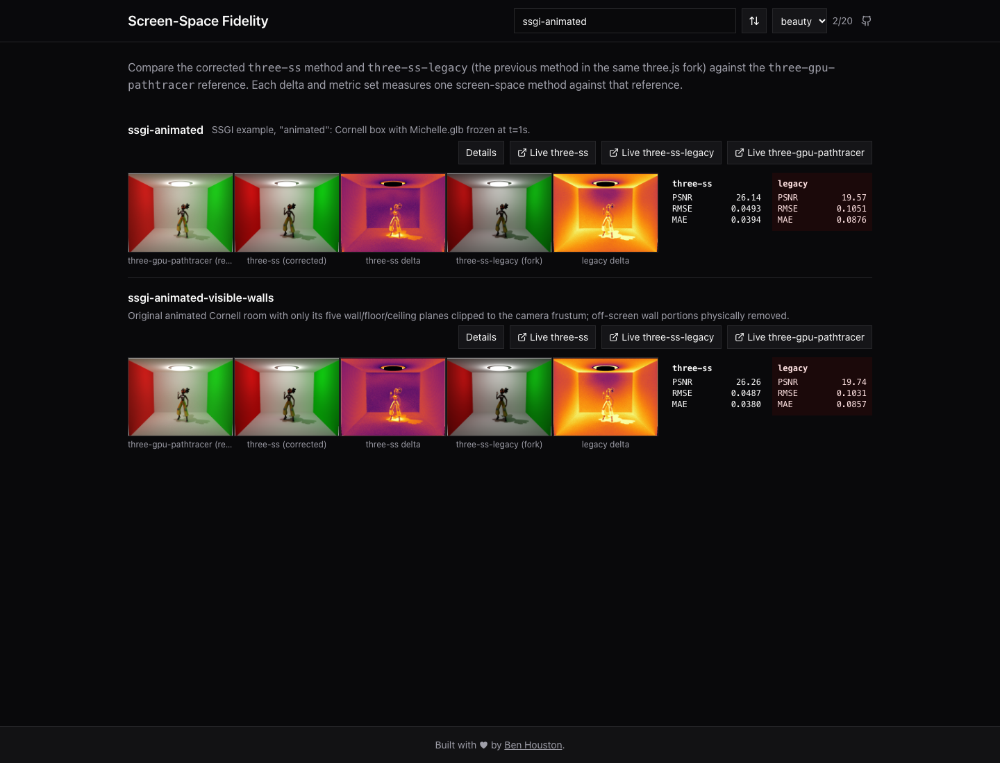

# Comparing SSGI methods

All screen-space methods use the same `bhouston/three.js` codebase, the same SSGINode, and the same scene setup. Select the integration method by renderer name:

| Renderer               | Method                                                                                                                                                                                                                                                                                                                            |
| ---------------------- | --------------------------------------------------------------------------------------------------------------------------------------------------------------------------------------------------------------------------------------------------------------------------------------------------------------------------------- |
| `three-new-ssgi`       | Corrected sample-direction solid-angle weighting (default).                                                                                                                                                                                                                                                                       |
| `three-ss-legacy`      | Previous equal-angle-sector weighting. This is the legacy method in our fork, not unmodified upstream three.js.                                                                                                                                                                                                                   |
| `three-new-ssr`        | `three-new-ssgi` plus reference-quality SSR (vendored node in `packages/renderers/src/ssr/`): stochastic GGX VNDF rays, ratio estimator, dense march, dual-layer depth, re-shaded hit specular with a second bounce, 256-frame running mean. See `SSR_IMPROVEMENTS.md`.                                                           |
| `three-new-ssr-fast`   | `three-new-ssr` with five optimization rounds (≈2× faster, +0.61% RMSE).                                                                                                                                                                                                                                                          |
| `three-new-ssgi-fast`  | `three-new-ssr-fast` with three SSGI-side optimization rounds ported from `perf/ss-optimize` by default (≈1.4× faster on top of `three-new-ssr-fast`, up to 1.85× on SSGI-heavy scenes; +0.17% mean RMSE); a fourth round is implemented and quality-gated but shipped off (no benefit on light-SSGI scenes). See `SSGI_FAST.md`. |
| `three-gpu-pathtracer` | Path-traced reference with scene-space visibility.                                                                                                                                                                                                                                                                                |

`three-new-ssgi` and `three-ss-legacy` differ only in GI sample weighting. They share sample counts, radius, thickness, GI intensity, AO, SSR, temporal reconstruction and AA. Direct and AO outputs should agree between them. Keeping geometry and quality settings fixed lets us measure future estimator improvements independently of the sampling budget.

Cornell scenes (`ssgi-basic`, `ssgi-rounded`, `ssgi-metallic`, `ssgi-animated`, and the clipped-wall control) now use **8 slices, 32 steps, screen radius 32 and thickness 4**, with the existing GI intensity π²/2 and 128 frames. This takes sixteen times as many depth samples as the original 2/8 preset; actual frame cost also depends on early exits and other passes. Asset-free `gi-*` controls retain their deliberately varied settings. The exterior Dogwood scene retains its world-space radius and thickness.

## Rendering and comparing

```sh
pnpm build
pnpm cli render --scenes 'ssgi-*' --passes beauty --renderers 'three-new-ssgi,three-ss-legacy'
pnpm cli compare --scenes 'ssgi-*' --passes beauty
```

Render path-tracer references when missing using `--renderers three-gpu-pathtracer --samples 1024`. Both CLI commands accept `--output <directory>` for isolated experiment results. A single method can be selected with `--renderers three-ss-legacy`. The viewer displays both results and each method's error against the same path-traced reference; old folders with only one method still load.

The files in each `results/<scene>/<pass>/` directory are:

Every screen-space renderer `R` uses the same `R.avif`, `delta-R.avif`, `metrics-R.json` naming, for example:

- `three-new-ssgi.avif`, `delta-three-new-ssgi.avif`, `metrics-three-new-ssgi.json`
- `three-ss-legacy.avif`, `delta-three-ss-legacy.avif`, `metrics-three-ss-legacy.json`
- `three-new-ssr.avif`, `delta-three-new-ssr.avif`, `metrics-three-new-ssr.json`
- `three-gpu-pathtracer.avif` for the reference (never compared against itself).

Live routes use the same names, for example `/live/ssgi-animated/three-ss-legacy`. Both screen-space renderers keep accumulating frames; neither uses the path tracer's sample limit.

## Using the node directly

The fork's parameter is per node and can change without creating another node class:

```js
const gi = ssgi(previousRadiance, depth, normal, camera);
gi.useSolidAngleWeighting.value = true; // corrected, default
// Or false for the legacy integration method.
```

The renderer factory selects this parameter for each independently constructed pipeline:

```ts
const corrected = await createRenderer('three-new-ssgi', canvasA, setupA, options);
const legacy = await createRenderer('three-ss-legacy', canvasB, setupB, options);
const newSSR = await createRenderer('three-new-ssr', canvasC, setupC, options);
```

Use independent equivalent scene setups/canvases for the two pipelines. No source loader is involved in these normal renderer paths. When toggling the node parameter interactively, allow its temporal/beauty feedback history to converge; creating a fresh renderer gives a clean measurement.

The existing per-sector shader prototype remains an investigation tool, not another production renderer. A separate `SSGI2Node` is unnecessary for a weighting-only difference; a future algorithm with different sampling, buffers or visibility could justify its own node while retaining this renderer-name interface.

## Historical measurements

[The investigation](GI-ESTIMATOR-FOLLOWUP.md) records both low- and high-quality experiments. Its old `baseline` label refers to the original weighting and original quality, not the current default. The investigation scripts explicitly restore the original Cornell sampling settings before applying their recorded overrides; the normal CLI uses the new high-quality scene preset. Use `GI_SHADER=legacy` or `GI_RENDERER=three-ss-legacy` with `gi-estimator-sweep.mjs` for the old weighting. `gi-sweep.mjs` reproduces the original legacy sensitivity experiment.

Saved beauty comparisons are regenerated for the current renderer choices. Historical JSON data and the investigation comparison figure retain the original measurements and settings. Git records earlier snapshots, so future changes can be compared without relabelling old results as current.

## Validation snapshot

The [recorded comparison](renderer-method-validation.json) covers all 20 scenes. Corrected weighting reduces beauty RMSE in 13 scenes, leaves six unchanged, and slightly increases it in the open low-albedo control (0.01169→0.01277). That control already has a direct-light baseline mismatch, so total beauty error is not a pure GI-energy measure. All five Cornell scenes improve at matched settings; animated Cornell changes from 0.10511 to 0.04931. Dogwood changes from 0.08219 to 0.08131.

Fifteen isolation checks produce identical PNGs: the five Cornell direct passes, five Cornell AO passes, and five SSR-only beauty scenes. Thus the named method switch affects GI weighting without changing those outputs. The clipped-wall AO reference is absent, so its AO images are compared to each other without a path-traced error claim.

The viewer was checked in a local headless browser: both metrics appear, both comparison sliders respond independently, and the scene/detail pages render without page errors.


