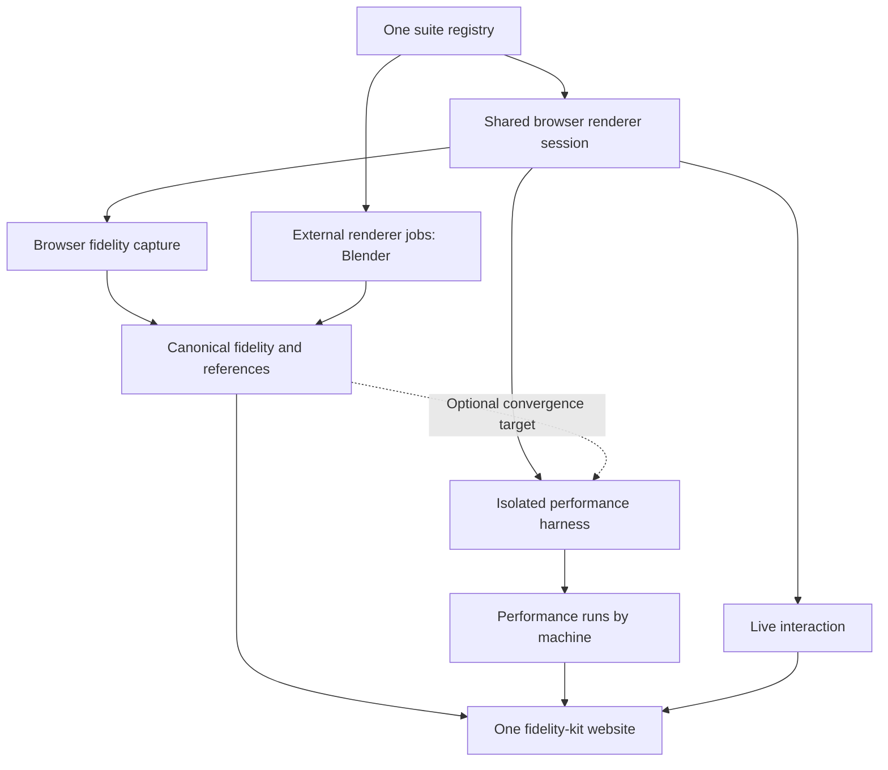

# Unifying live rendering, fidelity and performance in fidelity-kit

Status: proposal; no runtime or dependency migration in this PR. Tracking: [#206](https://github.com/bhouston/three-ss-fidelity/issues/206).

## Recommendation

Make **fidelity-kit the single public package, CLI and website**. Move performance-kit's runner, browser reporter, convergence sampler, metric processing and charts into that package. Keep internal modules separated by responsibility, with browser-safe exports and optional browser automation dependencies. Consumers should eventually need no performance-kit package or submodule.

The foundation is one suite registry and a shared browser renderer session. Fidelity capture, performance measurement and live interaction select the same scene and fully resolved renderer configuration, then apply different execution policies. Combining the websites alone would leave the current configuration drift intact.

Fidelity images and their comparison metrics are canonical across machines, under this project's quality-equivalence assumption. Performance runs, including time to reach a reference quality, are machine-specific. Performance coverage is an explicit subset, independent of fidelity coverage and live availability.

Start development by replacing this project's npm fidelity-kit dependency with a pinned `submodules/fidelity-kit` workspace dependency. Then migrate in small stages, preserving existing suites and results throughout.



## What exists today

This study uses ss-fidelity `e0cd955181b`, its pinned performance-kit `5cf1086d055`, the installed fidelity-kit 2.3.0 API, and the local fidelity-kit source checkout `01d09babb412`. The latter is a development snapshot, not a claim that every source change is in the installed release. The original checkout's uncommitted `performance-suite.json` change is excluded from the study worktree.

| Area             | Existing design                                                                                                                                                                                                                                                                                                                                                                                     | Consequence                                                                                                                                                                                   |
| ---------------- | --------------------------------------------------------------------------------------------------------------------------------------------------------------------------------------------------------------------------------------------------------------------------------------------------------------------------------------------------------------------------------------------------- | --------------------------------------------------------------------------------------------------------------------------------------------------------------------------------------------- |
| Fidelity-kit     | Its [core schema](https://github.com/bhouston/fidelity-kit/blob/01d09babb4122e05768e962b4ca0b0d32596ceae/packages/cli/src/core/schema.ts) declares renderer IDs, labels, references and outputs. Its scanner discovers scenes from image folders. `process` computes PSNR and deltas; `dev`, `serve` and `build` provide the website.                                                               | It has a results catalogue, but no shared scene factory or renderer execution contract. Existing fidelity processing requires a reference renderer.                                           |
| Scene code       | [SceneDefinition and SceneSetup](../packages/scenes/src/types.ts) provide scene factories, asset loaders, camera, effects and native capture dimensions.                                                                                                                                                                                                                                            | Reusable browser/Node scene code already exists, but the contract is Three.js-specific and scene discovery in fidelity-kit is separate.                                                       |
| Renderer code    | [Renderer profiles and options](../packages/renderers/src/types.ts) and [createRenderer](../packages/renderers/src/index.ts) cover browser-capable Three variants and the WebGL path tracer.                                                                                                                                                                                                        | Engine implementations are mostly shared; named experiment configurations are assembled elsewhere.                                                                                            |
| Fidelity capture | [cli render](../packages/cli/src/commands/render.ts) constructs profiles and runs fresh child processes. [render-process](../packages/cli/src/render-process.ts) uses native Dawn/ANGLE or the separate Blender adapter.                                                                                                                                                                            | The fidelity execution host is different from the performance browser, with different defaults, random-seed lifetime and frame/sample stopping rules.                                         |
| Performance-kit  | [Suite schema](../submodules/performance-kit/packages/schema/src/index.ts) repeats renderer/scene labels and supplies a URL plus arbitrary params for every entry. [runner](../submodules/performance-kit/packages/cli/src/runner.ts) launches isolated Chrome workloads.                                                                                                                           | Explicit entries already allow sparse performance coverage, but there is no relationship to the fidelity registry beyond matching names.                                                      |
| Live mode        | [performance-session](../packages/playground/src/performance-session.ts) shares initialization and drawing between automation and live mode. [performance-presets](../packages/playground/src/performance-presets.ts) derives renderer presets from the performance suite.                                                                                                                          | This is a useful starting point, but live availability should not depend on whether a renderer appears in a performance suite. The diagnostic playground remains another orchestration path.  |
| Machine results  | [Performance storage](../submodules/performance-kit/packages/cli/src/storage.ts) uses `<machine>/<renderer>/<scene>/metrics.json` and report-index schema v2; processed metrics are schema v3.                                                                                                                                                                                                      | Machine separation is already implemented. The latest result replaces the previous result at the same tuple; different workloads or repeated runs need stronger identity.                     |
| Convergence      | [Browser sampler](../submodules/performance-kit/packages/reporter/src/convergence.ts), [reference normalization](../submodules/performance-kit/packages/cli/src/convergence.ts) and [this project's convergence suite](../performance-suite-convergence.json) already support optional PSNR targets, reference display and final diffs.                                                             | Reuse this functionality and replace file-path coupling with reference artifact IDs.                                                                                                          |
| Websites         | The [fidelity viewer](https://github.com/bhouston/fidelity-kit/blob/01d09babb4122e05768e962b4ca0b0d32596ceae/packages/viewer/package.json) uses React, Tailwind, TanStack Router and shadcn/ui components backed by Radix. The performance viewer uses React/plain CSS and its own routing. [Deployment](../.github/workflows/deploy.yml) builds fidelity at `/` and performance at `/performance`. | Extend the fidelity viewer as the single site, porting performance components to its styling and router. The current deployment does not build/package the playground as a unified live site. |

Both kits already compare encoded sRGB8 RGB and represent infinite PSNR as `null`. They differ in alpha preparation and diff visualization: fidelity ignores alpha and produces an Inferno heatmap; performance reference normalization flattens alpha onto black and uses a 4× absolute RGB diff. A shared metric name is insufficient without a shared pixel contract.

## One registry, complete renderer configurations, explicit workloads

Use a project-authored `suite.ts` as the authoritative registry. Fidelity-kit validates it and emits a versioned, serializable `suite.json` for the CLI and website. Code factories stay in separately bundled browser/Node modules; metadata contains stable module identifiers, never evaluated JavaScript strings. Legacy `fidelity.json` can be generated during transition, rather than manually maintained as another renderer list.

Distinguish:

- **Scene:** reusable content, asset manifest/revision, named camera poses, output metadata and scene defaults.
- **Renderer adapter:** implementation factory and declared capabilities. This is where a Three.js version, Blender integration or another engine belongs.
- **Renderer configuration:** a stable user-visible renderer ID plus adapter ID and validated options. `three-new-ssgi-2x8` is a complete configuration, not a name reconstructed differently by each command.
- **Workload:** scene ID, renderer-configuration ID, output, dimensions, camera, deterministic scene time/motion, seed and all resolved quality options. Default resolution or implicit options must be expanded before execution.
- **Execution policy:** live, fidelity capture, pure performance, or convergence. Policies set scheduling, initialization/history, stopping and instrumentation; they do not silently alter renderer quality settings.

Use one lowercase filesystem-safe ID alphabet compatible with fidelity-kit. Import existing performance IDs with an explicit mapping where needed (`three-new--ssgi-2x8` versus the fidelity filename `three-new-ssgi-2x8`). Preserve old URLs and filenames through aliases, not fuzzy joins.

A resolved workload has a content hash over canonicalized configuration, scene/assets revision and renderer build/version. Fidelity artifacts and performance records reference that identity. Keep execution-policy hashes separately: a 10-second timing run and a 128-frame capture can share rendering configuration without claiming the same stopping/history policy. Arbitrary live camera changes create an exploratory session, not a comparable result under the original workload ID.

The kit remains engine-neutral: it does not import Three.js or interpret `SceneSetup`. This project supplies its scene/renderer adapter and delegates its existing factories to it. Image-only suites can continue using fidelity-kit with no executable renderer modules.

### Opt-in performance coverage

Specify an explicit list of workloads for each benchmark collection. Do not default to the scene × renderer Cartesian product, and do not encode performance participation in a renderer's global enabled flag. A renderer can be visible live and have canonical fidelity images while participating in only one benchmark scene.

For example, the following is illustrative proposed metadata, not an existing schema:

```json
{
  "schemaVersion": 1,
  "fidelity": {
    "workloads": ["cornell-base-640", "cornell-new-640"],
    "references": ["cornell-blender-640"]
  },
  "performance": {
    "collections": [
      {
        "id": "realtime",
        "entries": [
          { "workload": "cornell-base-1080", "policy": "fps-10s" },
          { "workload": "cornell-new-1080", "policy": "fps-10s" }
        ]
      },
      {
        "id": "progressive-quality",
        "entries": [
          {
            "workload": "cornell-new-640",
            "policy": "convergence-15s",
            "referenceArtifact": "cornell-blender-640",
            "convergence": { "interval": 0.25, "targetPsnr": 30 }
          }
        ]
      }
    ]
  }
}
```

The referenced workloads, policies and reference artifacts are declared elsewhere in the same registry; labels and implementation params are not repeated in these entries. Registry validation resolves all IDs and rejects unsupported combinations before launching a renderer. Adding a renderer or scene changes neither benchmark collection unless an entry is explicitly added.

Capability and result state are separate from selection. Represent `unsupported`, `not-selected`, `pending`, `failed` and `completed` explicitly. The current native CLI writes “Disabled” placeholder images for some combinations; import these as states rather than scoring them against a reference.

## One browser session, several hosts

Promote the useful parts of `createPerformanceSession` into a project-supplied adapter implementing a fidelity-kit session contract. The kit owns hosts and orchestration; the adapter owns actual rendering.

A proposed browser session exposes:

```ts
interface BrowserSession {
  render(frame: FrameContext): void;
  complete(): Promise<void>;
  capture(output: string): Promise<PixelBuffer>;
  setCamera?(camera: CameraState): void;
  resetHistory?(): Promise<void>;
  dispose(): void;
}
```

`PixelBuffer` declares width, height, channel format, row orientation, color space, alpha policy and ownership. Capture produces the declared output at the declared resolution; file encoding belongs to the host. Adapters declare support for progressive rendering, reset, camera changes, outputs and graphics APIs. Unsupported reset or configuration changes recreate the session. Creation accepts the resolved workload, canvas/host context, cancellation and a phase/progress callback. The generic kit need not know the shape of an engine scene object.

There are four policies around the same implementation:

| Host/policy              | Behavior                                                                                                                                                                                            |
| ------------------------ | --------------------------------------------------------------------------------------------------------------------------------------------------------------------------------------------------- |
| Live viewer              | User-controlled camera, browser display cadence, setup metrics and throttled local telemetry. No automated result publication by default. Start applies pending settings and resets charts/session. |
| Browser fidelity capture | Fresh browser context; fixed workload camera/time; specified frame/sample budget; await GPU completion, capture pixels and dispose. This becomes the canonical capture path for browser renderers.  |
| Browser performance      | Fresh isolated page/frame, declared compile/history policy, fixed duration and motion, buffered frame records. No React chart updates or image comparisons in the measured loop.                    |
| Convergence              | Same browser rendering implementation, explicitly enabled pixel sampling and a reference, with its overhead recorded as part of the run policy.                                                     |

Keep native Dawn/ANGLE capture as an optional diagnostic host initially. Sharing a factory does not make a native GPU context and Chrome equivalent. To achieve the requested same-renderer fidelity/performance contract, validate parity and then move canonical browser-renderer fidelity captures into the browser harness. Blender remains a native reference producer.

Preserve performance-kit's isolation, browser flags, fixed DPR, network/cache policy, initialization watchdogs, exact frame statistics, capture-after-measurement and all-or-nothing failure behavior. Do not put the benchmark inside the website's React render loop. The unified site can embed or launch the same compiled renderer entry, while automation selects an isolated mode with UI and local telemetry disabled. Pass normalized configuration through a versioned protocol and validate it in the renderer page.

Preserve stock/fork runtime isolation from the recent Three-Base fix. One adapter may deliberately use another Three.js version; bundling must keep each TSL runtime consistent. Shared scene content does not justify redirecting every import to one global engine copy.

## Fidelity-kit owns render production and the CLI

Move the orchestration currently in ss-fidelity's `cli render` into fidelity-kit itself, rather than requiring each consuming project to keep its own render CLI. Fidelity-kit owns workload selection, fresh browser/process isolation, frame/sample stopping rules, capture, encoding, artifact naming, cancellation, progress, skip-current behavior and result publication. The project owns scene construction, renderer implementations, adapter-specific option validation and asset serving. Native diagnostic tools can remain project-specific; they are not a prerequisite for generating the fidelity suite.

A configuration file plus a **renderer server root URL** is sufficient for browser production. The configuration describes the scene/renderer catalogue, workloads, capture policies and a browser entry point relative to that root. It need not require fidelity-kit to load the project's scene source or know its framework. A TypeScript registry can generate this config, but a project may also author the validated JSON directly; either way there is one authoritative catalogue, not separate renderer lists in the server and CLI.

Illustrative proposed endpoint metadata:

```json
{
  "execution": {
    "browser": {
      "entry": "./renderer.html",
      "protocolVersion": 1,
      "catalogueHash": "<hash-of-generated-catalogue>"
    },
    "external": {
      "blender": { "adapterModule": "./adapters/blender.mjs" }
    }
  }
}
```

Illustrative proposed commands:

```sh
# The project starts its existing renderer/asset server.
pnpm live

# Fidelity-kit supplies both orchestration commands.
fidelity-kit render --suite suite.json --root-url http://127.0.0.1:5173/ --out results/
fidelity-kit benchmark --suite suite.json --root-url http://127.0.0.1:5173/ --collection realtime --machine workstation --out results/
fidelity-kit build results/ --out site/
```

The root URL is an execution-location override, not part of rendering identity. Resolve the relative entry against a normalized directory URL, preserving hosted subpaths; do not silently replace `/my-project/` with the origin root. The CLI can target an existing development server or a separately started static renderer build. A later convenience option can serve a supplied renderer directory, using the same contract. `build` includes project-supplied renderer bundles/assets for deployed live views; it cannot infer them merely from a reachable development URL.

### The render producer interface and browser transport

Use the browser session interface above behind a small renderer-host helper supplied by `fidelity-kit/browser`. A project registers its adapter once, for example through a proposed `mountRendererHost(adapter)` API. The host selects live interaction, bounded fidelity production or performance measurement from a validated request and invokes the same adapter factory. The ordinary interactive website does not need to implement automation controls itself.

The wire contract carries a run ID, protocol version, catalogue/build identity, resolved workload and execution policy. It reports preparation phases, readiness, progress, structured errors, rendered frame/sample counts and requested output captures with pixel-format metadata. The kit checks catalogue/build identity before accepting output, so a stale server cannot silently run different options from those in the config. Session disposal and cancellation are explicit; successful artifact publication requires completed capture and validated output metadata.

Pass configuration before initialization, as performance-kit currently does with navigation parameters or an injected page bridge. Let the browser host execute the frame loop and stopping policy locally. **Do not make an HTTP request or Puppeteer call for every frame.** In performance mode, preserve buffered reporting and avoid polling/progress traffic during measurement. Fidelity mode can emit throttled progress and transfer captures when the declared frame/sample budget is complete. Large pixel captures may need chunked transfer; the transport should not require embedding raw image data into navigation URLs.

There is no requirement for the project server to expose REST endpoints for scene creation or each render step: it can simply serve the renderer page, compiled adapter and assets. Fidelity-kit launches the browser and communicates with the host through the existing iframe/page bridge model. Capability negotiation can also be served as generated static metadata; it must agree with the authoritative catalogue.

At the CLI boundary, model a render producer with browser and external implementations. Browser production uses the URL/host protocol. An external producer is a configured Node adapter with cancellation/progress hooks that returns declared captures through a native job call. Blender uses the existing adapter under that interface; it is not forced through a browser URL. The runner selects producers from renderer capabilities, allowing one `fidelity-kit render` invocation to generate browser captures and external references. Load external adapter modules only in the Node process, never in the browser bundle.

This removes ss-fidelity's duplicated selection/profile/child-process/capture/encoding orchestration once parity is established. Project-specific renderer options, motion definitions and scene semantics remain inside registered adapters and workload metadata; fidelity-kit coordinates them without accumulating Three.js/SSR-specific branches.

## Canonical fidelity, machine-specific performance

Store fidelity images/references once per workload, renderer configuration, output and capture-policy revision. A producer may record optional provenance, but **machine is not an axis in fidelity storage or navigation**. Accept the requested cross-machine quality assumption for equivalent software and resolved settings. Retain hashes/revisions and capture policy so that renderer changes or differing camera/resolution are not presented as machine differences.

Performance records reference the same workload, then add machine ID, run ID, browser version, GPU adapter/driver information when available, OS/CPU, renderer build, vsync, network policy and instrumentation. Missing machine metadata is unknown, never an invented value. Store repeats and revisions without overwriting one another. Do not pool different machines or measurement policies by default.

A possible logical layout:

```text
results/
  suite.json
  index.json
  fidelity/<workload>/<capture-policy>/<output>/
    capture.png
    preview.avif
    comparison.json
  references/<artifact-id>/
    image.png
    manifest.json
  performance/<machine>/<workload>/<policy>/<run-id>/
    metrics.json
    screenshot.avif
    convergence.json                 optional
  machines/<machine-id>.json
```

This is a logical target, not a requirement to immediately relocate existing folders. Immutable artifact versions/hashes distinguish replacement captures under a stable logical reference ID. A generated unified index joins existing fidelity and performance locations first. Performance reference links include the exact artifact hash; new references must not silently change historical convergence results.

A final performance screenshot is a run artifact, not an automatic replacement for canonical fidelity. Convergence samples and time-to-quality are also machine-specific: faster machines advance progressive rendering farther during a fixed wall-clock window. Their final quality should be compared at equal sample/frame budgets when evaluating the project's quality-equivalence assumption.

## References and convergence

Separate **displaying a reference** from **measuring convergence**. The site can show the canonical reference next to any matching performance workload without enabling in-loop sampling. A pure FPS run remains free of quality readbacks. Convergence is an explicit entry/run option, not a side effect of having a reference available.

Resolve references by artifact ID, output and content hash. Require exact dimensions, camera/pose, scene revision, output transform and color contract; fail clearly when incompatible. The ordinary 1920×1080 performance suite cannot use an existing 640×480 reference directly. Generate a matching reference or use a separately named 640×480 convergence workload. Do not silently upscale or crop.

Reuse performance-kit's sampling cadence, missed-tick skipping, first measured-frame sample, PSNR curve, final reference/diff display and observed threshold crossing. Clarify the history policy: today's readiness boundary renders and completes a first frame, and expensive baking can occur before readiness. Report both initialization time and observed time-to-target after ready; optionally show their sum using the same reporter clock. Do not call that sum a measured cold-start crossing if the sampler did not observe initialization frames.

Use one browser-safe RGB comparison implementation plus Node decoding adapters. Establish explicit sRGB8, channel/alpha and tone-mapping rules; existing opaque beauty captures are the easiest first scope. Preserve old metric semantics when importing older records. Compare lossless pixels before preview encoding for new captures, while imported AVIF references remain explicitly identified as comparisons against decoded AVIF pixels. Heatmap style is visualization, not a different PSNR algorithm.

Convergence readback/CPU comparison affects measured performance. Mark those runs separately from pure FPS and record cadence/readback policy; do not subtract estimated overhead or compare them as equivalent speed tests. Existing PSNR `null` means infinity for exact matches, not missing data. A first sampled crossing is neither interpolated nor proof of sustained convergence.

Manual camera motion invalidates a fixed reference comparison. Live mode can continue displaying a labeled reference, but pauses quality scoring until the original pose is restored. Scripted motion needs matching pose/time references; a single static reference is insufficient.

## Blender and other external renderers

Keep Blender in the same renderer catalogue, with an external execution capability rather than a fake browser session. Its images are ordinary fidelity/reference artifacts. A static website can display those images and stored job information without running Blender.

The existing [Blender adapter](../submodules/fidelity-kit-blender/README.md) already has cancellation, timeouts, diagnostics and subprocess log callbacks. Structured sample progress and incremental image previews are not part of its current public contract. Add a local/server job API later if useful: start/cancel job, stream structured progress via SSE, and publish throttled preview images with sequence numbers. Prefer worker-emitted events over relying on unstable human-readable log text.

That is remote rendering displayed in the browser, not Blender executing in it. It needs a running local or hosted service; GitHub Pages cannot provide that service. Interactive camera edits would require cancelling/restarting or a future persistent worker. Keep browser FPS rankings separate from external job durations. The Blender and path-tracer adapter packages can remain optional integrations; the requirement to absorb performance-kit does not require vendoring every rendering engine into fidelity-kit.

## Package and site structure

Develop internal schema, image, browser, runner and viewer modules within the fidelity-kit repository, but publish one public package:

| Proposed export/command                            | Purpose                                                                                                |
| -------------------------------------------------- | ------------------------------------------------------------------------------------------------------ |
| `fidelity-kit` and existing subpaths               | Preserve current comparison/processing API and folder-only use.                                        |
| `fidelity-kit/schema`                              | Versioned catalogue, workload, artifact and performance types/validation.                              |
| `fidelity-kit/browser`                             | Lightweight reporter/session contracts and local telemetry; no Sharp, filesystem or Puppeteer imports. |
| `fidelity-kit/runner`                              | Browser capture and performance automation with lazily loaded browser tooling.                         |
| `fidelity-kit render` / `benchmark`                | Generate canonical captures or execute opted-in performance entries from one suite.                    |
| `fidelity-kit process` / `dev` / `serve` / `build` | Process, watch and publish one combined dataset and website.                                           |

Fidelity-kit currently uses Zod and performance-kit uses TypeBox/Ajv. Initially preserve their validators behind import/compatibility adapters. Choose one authoritative schema definition for each new unified record and emit types/JSON Schema from it; do not independently re-declare the same workload shape in both systems. Consolidating validation libraries is secondary to preserving data semantics.

Use an optional Puppeteer peer or equivalent explicit browser-runner installation, so image-only consumers do not acquire a mandatory browser runtime/download. Validate the optional dependency when a browser command is invoked. Internal workspace packages need not be separately published. Transitional performance-kit exports/commands can forward to fidelity-kit; retire them after consumers migrate.

Use fidelity-kit's React/Tailwind/TanStack Router UI with shared controls, image viewers and reusable performance charts. One scene page offers Live, Fidelity and Performance views; scene/renderer/output/reference selection is shared. Machine and benchmark-policy selectors apply only to performance. Show sparse coverage as “not benchmarked,” rather than missing fidelity. Include convergence curves alongside FPS when enabled.

Retain query-based scene routes and base-path handling so static subdirectory hosting works without server rewrites. A live route also requires the project-generated renderer bundle and assets; the generic fidelity-kit static build cannot manufacture executable scene code from images. Extend the consuming project's build to provide that bundle/asset manifest. Ordinary live views can degrade when cross-origin isolation is unavailable; automated benchmarking must verify required headers/capabilities. Display unavailable live support clearly.

## Development and migration sequence

1. **Use a fidelity-kit submodule without changing behavior.** Add the requested `git@github.com:bhouston/fidelity-kit.git` at `submodules/fidelity-kit`, pin a reviewed commit, include its CLI/viewer workspace packages and replace `fidelity-kit: ^2.3.0` with `workspace:*`. Reconcile the two repositories' pnpm versions, overrides and package-name collisions before linking; update build order, CI submodule checkout and docs. Prove existing fidelity process/build output still works. Keep performance-kit until its functionality is ported.
2. **Unify identities and configuration in ss-fidelity.** Introduce the suite registry, complete renderer profiles and resolved workloads. Generate compatibility fidelity/performance manifests from it. Derive live choices from capabilities, not performance entries. Test round trips for experiment IDs and disabled combinations. Existing images and performance results remain in place.
3. **Unify browser execution.** Generalize the shared session, register it with the kit renderer host, and add `fidelity-kit render` driven by config plus a root URL. Validate a stock renderer, an experimental configuration and the browser path tracer against current capture baselines, with lossless pixels and explicit frame/sample rules. Assert visible scene pixels and shader failures, not only readiness/FPS. Keep Node diagnostics and Blender outside the browser bundle; expose Blender as an external render producer to the same CLI.
4. **Bring performance machinery into fidelity-kit.** Port schema/derivation, reporter/protocol, runner/isolation, downloads, machine storage and optional convergence, preserving timing semantics. Package browser exports independently of Node dependencies. Add adapters for current schema-v3 metrics/schema-v2 indexes and legacy fidelity folders. Run current kit and merged runner side by side on the same host/policies.
5. **Ship one site and build.** Join existing artifacts under one index, port charts into the fidelity viewer, package live modules/assets, and update deployment to one build. Verify a scene with fidelity-only data, a sparse multi-machine benchmark, multiple references and a browser live session. Static hosting must work with no local renderer service installed.
6. **Remove duplication.** Change project commands/imports to fidelity-kit, delete hand-maintained duplicate manifests, retire performance-kit submodule and transitional wrappers once its consumers migrate. Consolidate diagnostic features or retain them as an explicitly separate development host using the same session/configuration.

Do not silently regenerate or overwrite canonical references during performance runs. Import existing results with their known provenance; mark missing workload/policy information as legacy/unknown rather than manufacturing hashes. New records can coexist with old ones, but comparisons requiring unavailable compatibility metadata should be refused or labeled unverified. Version catalogue, protocol, fidelity artifacts and performance records independently so a UI merge does not imply every historical result is compatible.

## First implementation milestone and acceptance criteria

The smallest useful milestone is **submodule development + shared registry + generated compatibility manifests**, before moving the performance runner. It removes configuration duplication and lets later work happen in the requested fidelity-kit repository.

Acceptance criteria for the overall migration:

- A project exposing only a validated config, renderer page and assets can produce browser fidelity captures using `fidelity-kit render --root-url`, without a project-specific render CLI.
- A stale catalogue/server mismatch fails before publishing artifacts, and render loops require no per-frame cross-process commands.
- One complete renderer configuration resolves identically in live, browser fidelity and performance hosts; only declared execution policy differs.
- Adding a scene/renderer makes it eligible for supported live/fidelity modes without automatically adding a benchmark entry.
- Canonical fidelity is shared across two machines, while performance runs retain independent machine/run records.
- A reference can be displayed in a pure FPS view with no convergence sampling; enabling convergence records the same exact artifact/hash and matching dimensions.
- Readiness/compilation/history, frame statistics and GPU/network instrumentation retain their documented boundaries. Capture and UI updates stay outside pure measurement.
- Switching renderers leaves no cross-runtime shader state or leaked GPU resources; cancellation/failure publishes explicit state and no successful partial run.
- Blender appears as a reference producer without being offered as an executable browser renderer; optional server progress degrades cleanly on static hosting.
- Existing image-only fidelity suites still process and build; current performance results remain readable; one static export exposes all available views from a subdirectory.

The central decision is the registry/session contract. Once that is agreed, absorbing performance-kit's implementation into fidelity-kit is a staged code migration rather than a second redesign of rendering and measurement.
