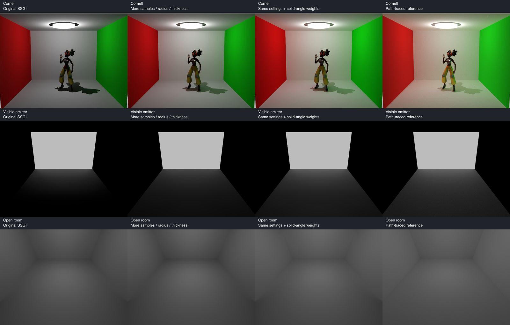

# Indoor SSGI: angular weighting follow-up

> **Historical log.** Renderer names here (`three-new-ssgi`, `three-new-ssr`, `-fast`, `-ssgi-fast`, `-rt`, `three-ss-legacy`) and `ssgi.ts` predate the consolidation into `three-new` / `three-new.ts` and `three-current` (issue #40). What is kept today is summarized in [../THREE-NEW.md](../THREE-NEW.md).

September 25, 2026; continuation of [issue #9](https://github.com/bhouston/three-ss-fidelity/issues/9) and [the initial investigation](GI-INVESTIGATION.md).

We found a substantial, reproducible improvement without changing GI intensity or adding unseen lighting. The local three.js visibility-bitmask estimator counts equal **slice-angle** sectors but does not include the spherical solid-angle Jacobian. A process-local shader experiment adds that directional weight. Together with a larger sampling footprint and more samples, it reduces the original Cornell beauty RMSE from **0.16462 to 0.04931 (70.0%)**. This is display-RGB RMSE, not a percentage of missing physical energy.

## Default promotion

The lightweight `sample-jacobian` correction is now the default in the `ssgi-traa-redesign` branch of [bhouston/three.js](https://github.com/bhouston/three.js/tree/ssgi-traa-redesign), and the parent submodule reference follows that change. Ordinary `SSGINode` users receive the corrected weighting without an experiment loader or opt-in flag. The GI intensity and AO algorithm remain unchanged. Following the investigation, Cornell scenes now use the higher-quality 8/32, radius-32, thickness-4 preset. The old weighting remains available as `three-ss-legacy` at identical quality; see [renderer methods](RENDERER-METHODS.md). Asset-free diagnostic controls and exterior world-space settings retain their original parameters. At original Cornell sampling settings the correction changes RMSE from about 0.16462 to 0.15587; at the documented higher-quality settings it reaches 0.04931.

The tables and [76-run dataset](gi-estimator-metrics.json) below record the investigation **before promotion**. In those records, `baseline` means the old weighting. New runs with no `GI_SHADER` override (or `baseline`/`sample-jacobian`) use the native corrected shader. Use `GI_SHADER=legacy` to reproduce the old weighting. Legacy selection uses the per-node parameter. Other experimental modes explicitly replace the native correction rather than applying it twice. Historical measurements remain in the investigation JSON/figure; saved beauty images are regenerated for the current methods. [Default-promotion validation](gi-default-validation.json) compares native rendering and legacy/per-sector controls with the recorded experiments.

The investigation ran actual headless WebGPU shaders; it was not an image brightness adjustment.

## Results and controls

All rendered comparisons use 128 SSGI frames unless stated otherwise, existing path-tracer references, unchanged direct lighting and unchanged GI intensity π²/2. `dense` means 8 slices / 32 steps; radius is screen-space radius. Full data, including negative results and effective overrides, is in [gi-estimator-metrics.json](gi-estimator-metrics.json).

| Original Cornell (`ssgi-animated`)                                 |        RMSE |         PSNR |
| ------------------------------------------------------------------ | ----------: | -----------: |
| Original shader and settings                                       |     0.16462 |     15.67 dB |
| Sample-direction Jacobian, original sampling settings              |     0.15587 |     16.14 dB |
| Original shader, dense, radius 32                                  |     0.12921 |     17.77 dB |
| Original shader, dense, radius 32, thickness 4                     |     0.10511 |     19.57 dB |
| Per-sector solid-angle weights, dense, radius 32                   |     0.09703 |     20.26 dB |
| Per-sector weights, dense, radius 32, thickness 4                  |     0.05470 |     25.24 dB |
| Per-sector weights plus off-axis azimuth correction, same settings |     0.05364 |     25.41 dB |
| Sample-direction Jacobian, dense, radius 32, thickness 4           | **0.04931** | **26.14 dB** |

At 512 frames the sample-direction variant gives Cornell RMSE **0.04832**, close to its 128-frame value; the closed high-albedo receiver remains **0.13471** (37.1% of reference). This run did not show runaway feedback, but does not establish stability for arbitrary albedos, lighting or motion.

The last row is a cheaper approximation that adds a directional factor to the existing sample weight. Its equal-settings improvement is **53.1%**, from 0.10511 to 0.04931. The mathematically more explicit per-sector method improves that equal-settings comparison by 48.0%. The cheaper variant's slightly better match in this view is not proof that it is a more accurate integrator: other approximation errors can cancel.



The figure uses the per-sector variant, which has the broader camera/control evaluation below. Images are resized for comparison; metrics use original resolution. Residual Cornell errors include dark character shadows, contact regions and local color differences.

### Visible emitter and camera variation

The corner's ideal Lambert floor-center radiance is **0.0334901**. The path tracer's 16×16 patch is **0.0387540**, partly because it uses Disney diffuse instead of raster Lambert. They are different reference targets. The experiment does not force Lambert to match that brighter BRDF.

| Corner, default camera                                   | Floor-patch linear radiance | Fraction of analytic point value |
| -------------------------------------------------------- | --------------------------: | -------------------------------: |
| Original settings and shader                             |                     0.01256 |                            37.5% |
| Original shader, dense, radius 32                        |                     0.01882 |                            56.2% |
| Per-sector weights, dense, radius 32                     |                 **0.03260** |                        **97.3%** |
| Per-sector weights, dense, radius 32, thickness 4        |                     0.03132 |                            93.5% |
| Sample-direction Jacobian, dense, radius 32              |                     0.03375 |                           100.8% |
| Sample-direction Jacobian, dense, radius 32, thickness 4 |                     0.03208 |                            95.8% |

At fixed dense/radius-32/thickness-1 settings, changing camera position from `(0,6,10)` to `(0,12,10)` and `(0,16,6)` gives original-shader analytic ratios **56.2%, 51.7%, 54.6%**, versus **97.3%, 92.8%, 92.7%** with per-sector weights. All four emitter corners remain inside the image in each view; their projected coordinates are recorded. Changed cameras are compared only against the analytic point value, not against images rendered from another camera. The measured patch covers a small region around that point, so these ratios are approximate, not exact pointwise error bounds.

### What did not explain the deficit

With sampling jitter, AA, AO, SSR and beauty feedback preserved, injecting raw GI instead of reconstructed GI changes original Cornell RMSE only from **0.16462 to 0.16419**. Corner receiver radiance rises from **0.01256 to 0.01319**. A temporal-only diagnostic gives **0.01286**. Reconstruction is not the main source of the observed deficit in these static controls.

`RendererOptions.ssgiReconstruction` selects `raw`, `temporal` or default `denoised`. Raw means bypassing GI reconstruction before injection; it still uses beauty/TRAA feedback. Temporal retains reprojection/clipping but disables spatial offsets and luminance-weighted flicker suppression in the recurrent filter. The initial `temporalDenoise:false` sweep also disabled sampling jitter, so the dedicated controls supersede it for this attribution.

Skipping tangent samples before claiming visibility bits barely changes corner radiance (0.01256→0.01260) or Cornell RMSE (0.16462→0.16459). Snapping sampled UVs to depth texel centers changes the corner to 0.01271. Neither hypothesis explains the large deficit.

## Why the weight matters

Let α be the signed angle from the view direction inside a slice, and φ the azimuth around that direction. Physical irradiance integrates

`E = ∫ L(α,φ) max(0,N·ω) |sin α| dα dφ`.

The current shader uses the number of newly covered sectors divided by 32, times the cosine towards the sampled pixel, then averages slices and multiplies by π²/2. In the continuous limit, this corresponds to half the unweighted slice-angle measure. Its calibration is correct for uniform radiance when the receiver normal faces the camera, but not for general normals or directional sources. A global brightness multiplier cannot correct this directional dependence.

The inexpensive `sample-jacobian` experiment multiplies the existing GI contribution by

`2 sqrt(max(0, 1 - dot(pixelToSample, viewDir)^2))`.

The `solid-angle` experiment instead sums each newly covered bit's midpoint weight:

`(2/32) |N_projected| cos(relativeAngle) |sin(relativeAngle+n)|`.

Here `relativeAngle=(bit+0.5)π/32−π/2` and `n` is the shader's signed projected-normal angle. With existing π²/2 intensity and slice averaging this approximates the physical integral. It leaves AO's estimator unchanged. It also avoids assigning one sampled-point receiver cosine to an entire angular span. The prototype adds a 32-bit loop per contributing sample and is not a performance-ready replacement.

Uniform screen-space slice rotation is not uniform azimuth around an off-axis view vector. The optional `solid-angle-azimuth` mode additionally multiplies by `abs(viewDir.z)/(1-dot(sliceDir,viewDir)^2)`. This improves the tested full-frame Cornell result slightly; the main table separates that additional correction.

The independent [CPU oracle](../../scripts/gi-angular-oracle.mjs) integrates the rectangular wall's form factor and a constant-radiance hemisphere. It does not run the GPU visibility algorithm. It finds:

- The old angular measure gives 100%, 93.4%, 77.1%, and 63.7% of correct uniform-hemisphere irradiance at receiver/view tilts 0°, 30°, 60°, and 90°. The corrected measure stays within 0.01% of unity across the tested tilts.
- Within an idealized 140 px footprint, the corner contains 49.3% of its true irradiance; the old angular weighting captures only 30.2% of the full-wall reference. Even with the entire wall available it captures 56.6%.
- Independent closed-form corner irradiance and numerical quadrature differ by 2.5×10⁻⁷. Coarse/fine quadrature checks pass. [Oracle output](gi-angular-oracle.json) records the assumptions and checks.

The radius control is important: an emitter being on screen does not imply it lies within SSGI's sampling footprint. At width 480, radius 12 and 8 steps produce a nominal farthest offset around 140 px, modified by jitter. The emitter's upper corners are more than 200 px from the receiver. Enlarging radius without enough samples can also leave gaps.

## Remaining error and applicability

The corrected per-sector shader with dense/radius-32/thickness-4 settings produces closed high-albedo room receiver radiance **0.13448**, still only **37.0%** of the path tracer's **0.36335**. The cropped emitter enclosure remains exactly black, and even its wide view captures only about 20% of reference. Unseen transport still requires a separate lighting representation.

The open high-albedo room improves full-frame RMSE from **0.04613 to 0.02049**, but its apparently close receiver beauty is misleading. Subtracting each renderer's saved direct baseline gives corrected SSGI added light **about 0.01247**, versus path tracing **0.03542**: only about **35%** of the increment. Low-albedo receiver increments remain around PNG quantization limits. The underlying direct-light BRDF mismatch remains; no point-lit beauty ratio proves transport correctness.

The frustum-clipped original Cornell room improves to RMSE **0.05355** with the per-sector variant, consistent with the original room's improvement and the previous finding that unseen room-plane portions were not the main cause in that view.

These experiments leave single-depth visibility, thickness assumptions, finite radius, bit quantization, first-sample ownership of a sector, view-dependent input radiance, low-luminance cutoff, and reconstruction approximations in place. Thickness 4 is useful in this room but can cause inappropriate occlusion elsewhere. Existing references have finite path-tracing samples and bounce depth. Larger sampling settings cost substantially more; recorded wall times include shader compilation/readback and some runs overlapped, so they are not GPU frame-time benchmarks. A production change should optimize the weighting, benchmark it, and validate motion, thin objects, source gradients and exterior scenes before changing defaults.

## Literature and expected agreement

[Therrien, Levesque and Gilet, _Screen Space Indirect Lighting with Visibility Bitmask_](https://arxiv.org/html/2301.11376v2), §4.3/Figure 12, explicitly compares single/multiple bounce indirect diffuse with path tracing. It is a qualitative comparison, and the authors say a perfect match is impossible with only screen pixels. Algorithm 1 uses sector counts and sample-direction cosine weights; the paper does not establish this fork's π²/2 as a general physical calibration.

The [authors' SSRT3 implementation](https://github.com/cdrinmatane/SSRT3) also documents probe fallback for unavailable lighting. That supports a hybrid renderer, but does not explain underweighting of visible sources. Our Jacobian diagnosis is an independent derivation tested against the local implementation, not a claim made by the paper.

SSGI should reproduce the light it can represent reasonably well under matched material and lighting assumptions. It should not generally look pixel-identical to full-scene path tracing. The analytic visible-emitter test makes it possible to distinguish a correctable weighting error from that fundamental limitation.

## Reproduction and validation

Use Node 26 and the repository's pinned pnpm. Existing `results/` references from the original investigation are required.

```sh
pnpm build
node scripts/gi-angular-oracle.mjs
GI_SHADER=legacy node scripts/gi-estimator-sweep.mjs /tmp/ss-fidelity-estimator-initial
GI_SHADER=solid-angle node scripts/gi-estimator-sweep.mjs /tmp/ss-fidelity-solid-angle
GI_SHADER=sample-jacobian GI_VARIANTS='[{"name":"dense-radius32-thickness4","ssgi":{"sliceCount":8,"stepCount":32,"radius":32,"thickness":4}}]' node scripts/gi-estimator-sweep.mjs /tmp/ss-fidelity-sample-jacobian
GI_SHADER=legacy GI_VARIANTS='[{"name":"raw","reconstruction":"raw"},{"name":"temporal","reconstruction":"temporal"}]' node scripts/gi-estimator-sweep.mjs /tmp/ss-fidelity-reconstruction
```

Pass scene names after the output directory to select controls. `GI_VARIANTS` is a JSON array of independent overrides (`ssgi`, `reconstruction`, `frames`, `cameraPosition`, and optionally `temporalDenoise`/`noSSR`). Each run emits PNGs and `metrics.json`. The investigation harness restores the original Cornell sampling settings before applying variants, so its recorded experiments remain reproducible after the production quality preset changes. The consolidated metrics record the exact variants used for the other camera, visibility and negative controls. Alternative shader modes are implemented by a process-local Node loader with source-match guards; the loader does not patch three.js files on disk. The sample-direction correction itself now lives in the fork's normal SSGINode implementation.

Validation: `pnpm build`, `pnpm tsc`, `pnpm lint`, and `pnpm test --coverage` pass (40 tests). The numerical oracle checks pass and the comparison figure was visually inspected. `pnpm audit --audit-level=high` reports seven high and one moderate existing transitive vulnerabilities; high findings are in `tar-fs`, `ws`, and `extract-zip` under the path-tracer submodule's Puppeteer dependencies. No dependencies changed in this investigation.
