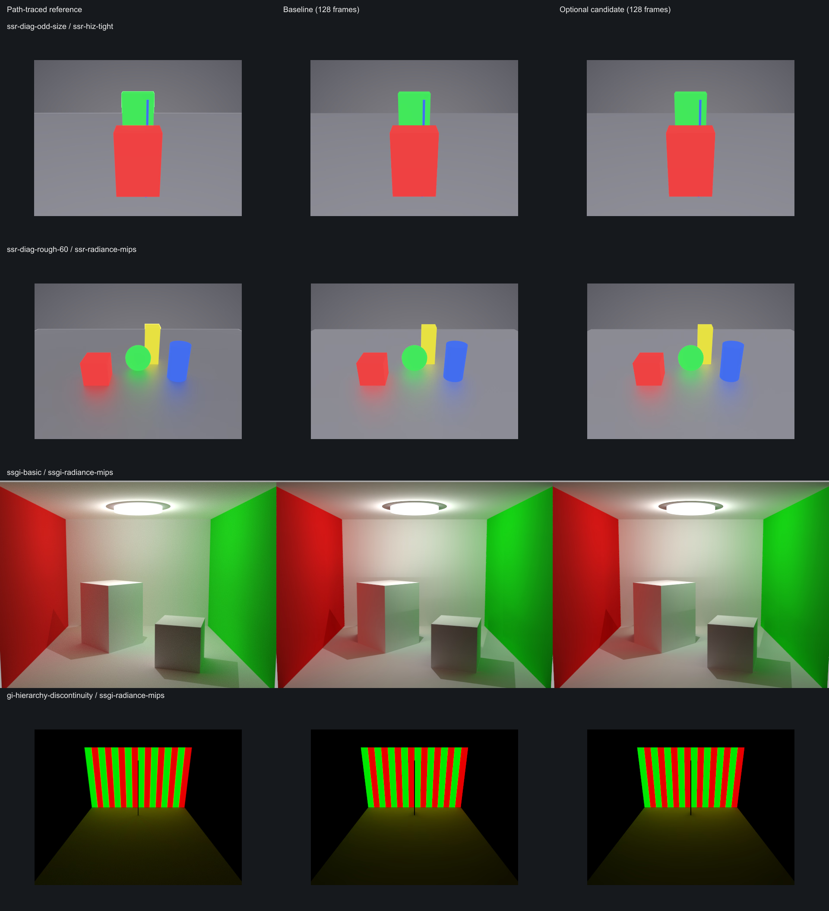

> Historical CLI examples below use the former render `--experiment` option. Current rendering selects full names, for example `--renderers three-new-ssr-hiz-tight`; benchmarking still uses `--experiment`.

# Optional hierarchical SSR / SSGI experiments

These experiments leave `three-new`'s default pipeline unchanged. Select one with `--experiment` on `cli render`
or `cli bench`, or `RendererOptions.hierarchyExperiment` when constructing a renderer. They require `three-new`;
other renderers reject non-baseline experiments. Changing the option requires a new pipeline.

## Research and design

[AMD FidelityFX SSSR 1.5](https://gpuopen.com/manuals/fidelityfx_sdk/techniques/stochastic-screen-space-reflections/)
uses a nearest-depth hierarchy for skipping empty cells, stochastic glossy rays, and spatial/temporal denoising.
The existing SSR implementation here already does these. A hierarchy must store conservative depth bounds, rather
than average depth: an average can erase a thin occluder. Coarse traversal is compatible with mirrors provided the
final intersection and radiance fetch retain full resolution. Reducing ray density is a separate quality tradeoff.

[McGuire and Mara, Efficient GPU Screen-Space Ray Tracing (2014)](https://jcgt.org/published/0003/04/04/paper.pdf)
discusses screen-space traversal and thickness handling. Our SSR accepts both near-front intersections and rays
inside solids, using front/back depths. A min/max skip-behind hierarchy would need bounds for **both** acceptance
rules, including the depth-dependent thickness; max front depth alone is unsafe. That remains a follow-up rather
than an unvalidated shortcut in this change.

[Mara et al., Deep G-Buffers for Stable Global Illumination Approximation (2016)](https://casual-effects.com/research/Mara2016DeepGBuffer/)
uses multiresolution data to improve the locality of distant gathers. It also uses additional geometry layers, which
cannot be reproduced by averaging the current single-layer buffer. The
[visibility-bitmask paper (Therrien et al., 2023)](https://arxiv.org/abs/2301.11376) is especially relevant because
our SSGI uses that estimator: changing sampled geometry changes which angular sectors are claimed. We therefore
keep depth, normals, positions, sample counts, and visibility full resolution in the radiance experiment.

Newer primary work includes [Holographic Radiance Cascades (2025)](https://arxiv.org/abs/2505.02041),
which combines short radiance intervals in a multilevel system for 2D GI, and
[Split Radiance Cascades (July 2026)](https://arxiv.org/abs/2607.20384), which adapts cascades to sparse world-space
probes and splits rays according to hit distance. [Sannikov's working paper](https://github.com/Raikiri/RadianceCascadesPaper/blob/main/RadianceCascades.tex)
also describes depth-buffer probes with bilateral spatial interpolation and increasing directional resolution.
Our assessment is that these are promising longer-term **estimator replacements**, requiring new probe/interval
storage and visibility reconstruction. They are not equivalent to color mips, and implementing them as a small
option on the current visibility-bitmask gather would not preserve its quality guarantees. They are documented
as a follow-up rather than claimed as implemented here.

Radiance prefiltering is not automatically a speedup. It needs mip construction, still performs the same number of
gathers, and can mix unrelated surfaces. GGX ray sampling already integrates rough reflections; additional color
mips may double-filter the lobe. Distance means **projected footprint**, not simply world distance: mirrors should
retain small details at any distance.

## Implemented experiments

| Option               | Change                                                                                                                                     | Quality precautions                                                                                                                  |
| -------------------- | ------------------------------------------------------------------------------------------------------------------------------------------ | ------------------------------------------------------------------------------------------------------------------------------------ |
| `baseline`           | Current pipeline.                                                                                                                          | Default.                                                                                                                             |
| `ssr-hiz-tight`      | Replace the unconditional 3×3 reduction footprint with 2×2, adding the leftover row/column only at an odd source edge.                     | Same full-resolution hit tests, binary refinement, radiance, ray budget, and filter. Uncovered edge cells still descend.             |
| `ssr-radiance-mips`  | Add a reprojected RG11B10 radiance target with average mips; primary hit LOD = clamp(log2(projected hit distance × roughness² / 8), 0, 2). | Roughness < 0.2 or footprint ≤ 1 reads the original source, including perfect mirrors. Secondary bounces retain the original source. |
| `ssgi-radiance-mips` | Generate mips on the existing reprojected GI source; gather LOD = clamp(log2(projected sample radius / 32), 0, 3).                         | Nearby radiance stays at mip zero. All geometric sampling remains full resolution.                                                   |

The old Hi-Z footprint is conservative but unnecessarily wide: an occluder in the neighbouring cell forces a
traversal descent even when the actual cell is empty. Tightening this footprint reduces both reduction fetches and
false descents. Odd edges still include every source texel; the fixed-width traversal deliberately refuses to skip
cells beyond the floor-rounded mip dimensions. Results can change when reduced false descents avoid exhaustion of
the unchanged 96-iteration budget, so this is measured rather than labelled bit-identical.

All new RTT targets participate in the pipeline's explicit disposal list and automatic resize. No submodule edits
are needed.

## Reproduce

```sh
pnpm build
pnpm cli render --renderers three-new --scenes 'ssr-diag-*' --passes beauty --frames 128 \
  --experiment ssr-hiz-tight --output "$PWD/.output/hierarchy-images"
pnpm cli bench --renderers three-new --scenes ssr-diag-occlusion --experiment ssr-hiz-tight \
  --warmup 60 --measure 120 --out "$PWD/.output/hiz-bench.json"

# Two new, asset-free diagnostics need references on the first run.
pnpm cli render --renderers three-gpu-pathtracer --passes beauty --samples 4096 \
  --scenes gi-hierarchy-discontinuity,ssr-diag-odd-size
# Quality comparisons can run while other CPU/GPU work makes timing unreliable.
node scripts/hierarchical-experiments.mjs --out .output/hierarchy --skip-timing
node scripts/hierarchical-quality.mjs --out .output/hierarchy-extra

# Run profiling later on an idle GPU.
node scripts/hierarchical-experiments.mjs --out .output/hierarchy-timing --skip-quality
```

`render` names variants `three-new-<experiment>.avif`, keeping the baseline intact, including motion/debug captures.
`fidelity-results/fidelity.json` recognizes all three experimental image IDs. To compare them in the viewer, render a
baseline with matching `--frames` into the same output directory, copy `fidelity-results/fidelity.json` there if using a
separate directory, and run `fidelity-kit process` there. `cli quality-gate` accepts the experimental image IDs too and reads PSNR-only metrics. `bench` records the experiment in its JSON. The experiment runner measures variants sequentially, alternating order
across three repeats. Every scene/variant uses a new process to avoid GPU state leakage. It records all synchronized
wall-time runs and a separate named-pass timestamp breakdown, with pyramid construction included. Apple GPU
pass timestamps can overlap; their sum is not a serial frame budget (see [../PERF.md](../PERF.md)).

Quality uses native scene dimensions, 128 frames, repository AVIF encoding, and decoded RGB8/sRGB PSNR in dB. Timing defaults to 1920×1080. `cli render --width/--height` can override native dimensions for additional quality captures. These are different resolutions: native-resolution quality is **not** proof
of 1080p quality. Reports include reference hashes, baseline-vs-candidate deltas, and a repeated baseline to expose
nondeterminism. The 0.1 dB maximum reference-PSNR-drop gate is per scene, so improvements elsewhere cannot hide a regression. Missing
references fail the run. Gates are reported, not used to abort exploration when a candidate fails. Inspect the saved
images and heatmaps as well; whole-image PSNR alone can hide a localized artifact.

Use `--experiments`, `--scenes`, `--width`, `--height`, `--frames`, `--repeats`, `--warmup`, `--measure`,
`--threshold`, or `--references` to customize the runner. `--quality-width` and `--quality-height` override capture dimensions; point `--references` at matching reference renders. `--skip-timing` / `--skip-quality` allow focused reruns.

`hierarchical-quality.mjs` supplements the reference gate with baseline/candidate captures at 1920×1080
(128 frames) and a 20° camera move over 16 frames at native resolution (captures at arrival, then 4, 16, and
64 frames at rest). It covers Hi-Z occlusion, rough SSR radiance, and the striped GI diagnostic, and saves PSNR and heatmaps. These are changes relative to the baseline, not independent ground truth. Inspect the heatmaps for
local artifacts. Its `--frames`, `--width`, `--height`, and `--out` options control the settled captures.

Existing SSR diagnostics cover mirrors, grazing rays, occlusion, rough lobes, and secondary specular bounces. The
new `ssr-diag-odd-size` repeats the thin-pole occlusion layout at 481×361. The new `gi-hierarchy-discontinuity` uses
alternating red/green emissive stripes and a thin black occluder; it exposes mip bleeding hidden by smooth emitters.

## Measurements

The user was running heavy CPU/GPU tasks during this exploration. A 1080p baseline changed from 9.33 ms to 665.36 ms between repetitions, so that profiling run was stopped and rejected. Earlier 720p numbers are exploratory observations, not validated speed claims. The quality-only run uses `--skip-timing`; its loaded-machine mirror baseline was byte-identical to the earlier capture, confirming that elapsed time is independent of the image comparison.

The committed [native-quality report](hierarchical/native-quality.json),
[1080p and motion report](hierarchical/extra-quality.json), and
[exploratory timing record](hierarchical/exploratory-timing.json) contain the full metrics. Captures and heatmaps
are kept locally under `.output/hierarchy-quality`, `.output/hierarchy-ssr-mips-final`, and `.output/hierarchy-extra`;
the two new 4096-spp path-traced references are committed in `fidelity-results/`. Commands above regenerate the artifacts.
All baseline repeats in the first full quality suite were byte-identical. The final SSR mip implementation was
recaptured after removing a redundant unfiltered fetch; its reference gates still pass. In that follow-up,
`ssr-diag-metal-hit`'s repeated baseline had a repeat-to-baseline PSNR of 55.58 dB (reference PSNR 31.94 dB), so small
changes should not be interpreted as improvements. The report preserves each experiment's matched baseline and repeat
noise, rather than comparing a candidate to a baseline from a different run. This is consistent with the
[known GPU nondeterminism issue](https://github.com/bhouston/three-ss-fidelity/issues/25).

### Native-resolution quality vs path tracing

All 15 experiment/scene comparisons pass the per-scene 0.1 dB maximum PSNR drop. Positive changes are better;
negative changes are worse. These comparisons measure quality differences against the path-traced reference.

| Experiment           | Scene                        | Baseline PSNR (dB) | Candidate PSNR (dB) | Change (dB) |
| -------------------- | ---------------------------- | -----------------: | ------------------: | ----------: |
| `ssr-hiz-tight`      | `ssr-diag-mirror`            |            36.5846 |             36.5846 |     +0.0000 |
| `ssr-radiance-mips`  | `ssr-diag-mirror`            |            36.5846 |             36.5869 |     +0.0022 |
| `ssr-hiz-tight`      | `ssr-diag-grazing`           |            34.2103 |             34.2210 |     +0.0107 |
| `ssr-hiz-tight`      | `ssr-diag-occlusion`         |            36.6322 |             36.6359 |     +0.0037 |
| `ssr-hiz-tight`      | `ssr-diag-metal-hit`         |            31.9452 |             31.9575 |     +0.0123 |
| `ssr-radiance-mips`  | `ssr-diag-metal-hit`         |            31.9437 |             31.9402 |     -0.0035 |
| `ssr-hiz-tight`      | `ssr-diag-rough-30`          |            37.1236 |             37.1241 |     +0.0004 |
| `ssr-radiance-mips`  | `ssr-diag-rough-30`          |            37.1236 |             37.1164 |     -0.0072 |
| `ssr-hiz-tight`      | `ssr-diag-odd-size`          |            37.9761 |             37.9651 |     -0.0111 |
| `ssr-radiance-mips`  | `ssr-diag-rough-60`          |            26.0346 |             26.0548 |     +0.0202 |
| `ssgi-radiance-mips` | `ssgi-basic`                 |            27.4811 |             27.6499 |     +0.1688 |
| `ssgi-radiance-mips` | `ssgi-rounded`               |            29.3477 |             29.5022 |     +0.1545 |
| `ssgi-radiance-mips` | `gi-emitter-corner-dense`    |            26.1078 |             26.0911 |     -0.0167 |
| `ssgi-radiance-mips` | `gi-room-open-high-albedo`   |            31.7259 |             31.6896 |     -0.0363 |
| `ssgi-radiance-mips` | `gi-hierarchy-discontinuity` |            35.1462 |             35.0983 |     -0.0479 |

### 1080p and camera-motion differences vs baseline

The 1080p captures use 128 frames at the same resolution as the intended future profiling. They compare to the
unchanged pipeline, not to a 1080p path-traced reference.

| Scene / experiment                                  | PSNR (dB) |
| --------------------------------------------------- | --------: |
| `ssr-diag-occlusion` / `ssr-hiz-tight`              |     64.11 |
| `ssr-diag-rough-60` / `ssr-radiance-mips`           |     57.33 |
| `gi-hierarchy-discontinuity` / `ssgi-radiance-mips` |     59.40 |

Across arrival / 4 / 16 / 64 frames after camera motion, the minimum baseline-to-candidate PSNR is
`ssr-diag-occlusion` 57.79 dB, `ssr-diag-rough-60` 51.04 dB, and `gi-hierarchy-discontinuity` 54.34 dB.
Visual inspection of the settled comparisons and motion captures found no obvious additional trails or light leaks.
Inspect thin silhouettes and heatmaps as well: whole-image PSNR can hide localized artifacts.



The figure shows native-resolution images without resampling, padded to equal cell sizes. Full images and heatmaps
are available in the local artifact directories.

### Performance status and next step

The initial 720p Hi-Z runs observed 1.147×, 1.186×, and 1.226× throughput on mirror, rough-0.3, and occlusion.
The earlier SSR radiance-mip prototype observed 0.919×, 0.951×, and 0.943× on the same scenes. These measurements
are **provisional**, and the SSR mip code subsequently changed to avoid an unnecessary base-level fetch. The loaded
1080p run was rejected. No reliable performance conclusion is available for either radiance-mip experiment.

The tighter Hi-Z option is the first candidate to benchmark on an idle GPU: it removes redundant depth samples
and false descents while passing the tested quality gates. Both radiance options remain experiments; their quality
is acceptable on this suite but speedups have not been established. Keep all three off by default until profiling
confirms total-frame savings, including pyramid construction. Repeat quality checks on complex assets, moving
objects, different GPUs, and unclipped HDR signals before generalizing these results.

### Repository validation

`pnpm build`, `pnpm tsc`, `pnpm lint`, `pnpm test --coverage` (85 tests), formatting, and diff checks pass.
`pnpm audit --audit-level=high` reports two existing `extract-zip` advisories through the pathtracer submodule's
Puppeteer development dependency. No dependencies or submodules were changed by these experiments.
